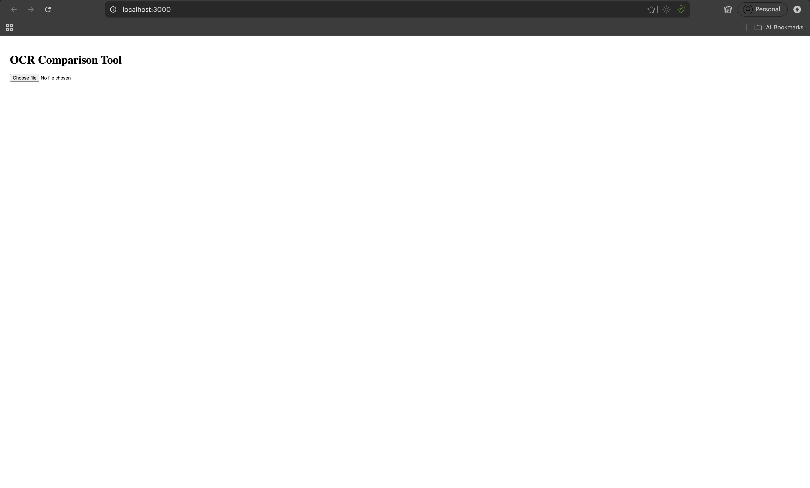
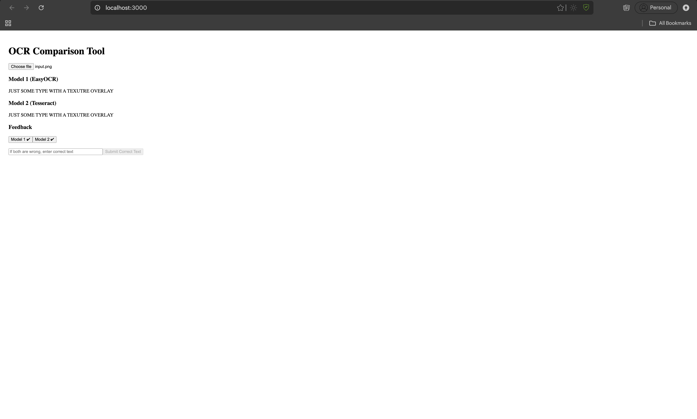
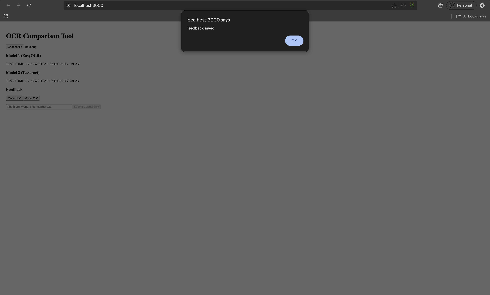

# OCR Comparison Tool (EasyOCR vs Tesseract)

A full-stack web application that allows users to upload images (e.g., vehicle number plates), compare OCR results from two different engines — **EasyOCR** and **Tesseract OCR** — and provide feedback on which model performs better.

---

## 🚀 Features

* 📤 Upload images from frontend (React)
* 🤖 Run OCR using:

  * EasyOCR (deep learning-based)
  * Tesseract OCR (classical OCR with preprocessing)
* 📊 Display side-by-side OCR results
* 🧠 Collect user feedback:

  * Select which model is correct
  * Provide manual correction if both are wrong
* 💾 Store feedback in a JSON database (`feedback.json`)

---

## 🏗️ Project Structure

```
OCR_COMPARE_PROJECT/
│
├── backend/
│   ├── database/
│   │   └── feedback.json
│   ├── ocr_models/
│   │   ├── easyocr_model.py
│   │   └── tesseract_model.py
│   ├── uploads/
│   ├── utils/
│   │   └── image_utils.py
│   ├── main.py
│   └── requirements.txt
│
├── frontend/
│   ├── public/
│   │   └── index.html
│   ├── src/
│   │   ├── components/
│   │   │   ├── Upload.js
│   │   │   ├── ResultCard.js
│   │   │   └── Feedback.js
│   │   ├── App.js
│   │   └── index.js
│   └── package.json
│
└── README.md
```

---

## ⚙️ Backend Setup (FastAPI)

### 1. Navigate to backend

```bash
cd backend
```

---

### 2. Install dependencies

```bash
pip install -r requirements.txt
```

---

### 3. Install Tesseract (Important)

Tesseract OCR must be installed separately.

#### macOS (Homebrew)

```bash
brew install tesseract
```

#### Ubuntu / Linux

```bash
sudo apt update
sudo apt install tesseract-ocr
```

#### Windows

Download and install from:
https://github.com/tesseract-ocr/tesseract

Default install path:

```
C:\Program Files\Tesseract-OCR\tesseract.exe
```

---

### 🔍 Verify Installation

#### macOS / Linux

```bash
which tesseract
```

#### Windows

```bash
where tesseract
```

---

### 🛠️ Configure Path (ONLY if needed)

If you get:

```
TesseractNotFoundError
```

Then update in `tesseract_model.py`:

```python
import pytesseract
pytesseract.pytesseract.tesseract_cmd = "YOUR_TESSERACT_PATH"
```

#### Examples:

* macOS (Apple Silicon):

```python
pytesseract.pytesseract.tesseract_cmd = "/opt/homebrew/bin/tesseract"
```

* macOS (Intel):

```python
pytesseract.pytesseract.tesseract_cmd = "/usr/local/bin/tesseract"
```

* Windows:

```python
pytesseract.pytesseract.tesseract_cmd = r"C:\Program Files\Tesseract-OCR\tesseract.exe"
```

---

### 4. Run backend server

```bash
uvicorn main:app --reload
```

Server runs at:

```
http://127.0.0.1:8000
```

---

## 💻 Frontend Setup (React)

### 1. Navigate to frontend

```bash
cd frontend
```

---

### 2. Install dependencies

```bash
npm install
```

---

### 3. Start frontend

```bash
npm start
```

App runs at:

```
http://localhost:3000
```

---

## 🔄 How It Works

1. User uploads an image
2. Image is sent to FastAPI backend
3. Backend:

   * Saves image to `/uploads`
   * Runs:

     * EasyOCR
     * Tesseract OCR (with preprocessing)
4. Results returned to frontend
5. User:

   * Compares outputs
   * Selects correct model OR enters correct text
6. Feedback stored in:

```
backend/database/feedback.json
```

---

## 🧪 OCR Models

### EasyOCR

* Deep learning-based OCR
* Handles noisy images better
* Returns detected text directly

### Tesseract OCR

* Classical OCR engine
* Uses preprocessing:

  * Grayscale conversion
  * Thresholding
* Sensitive to image quality

---

## 📦 Example Feedback Entry

```json
{
  "filename": "1.jpeg",
  "model1": "HR26 DK 1234",
  "model2": "HR26DK1234",
  "choice": "model1_correct",
  "correct": ""
}
```

---

## ⚠️ Limitations

* No object detection (reads full image)
* Performance drops for:

  * Small text regions
  * Blurry images
  * Angled number plates
* JSON used instead of database (not scalable)

---

## 🚀 Future Improvements

* 🔍 Integrate YOLO for number plate detection
* 🧠 Add accuracy metrics dashboard
* 🗄️ Replace JSON with database (SQLite/PostgreSQL)
* ⚡ Improve preprocessing pipeline

---

## 🧑‍💻 Tech Stack

* **Frontend:** React, Axios
* **Backend:** FastAPI (Python)
* **OCR Models:** EasyOCR, Tesseract
* **Image Processing:** OpenCV, Pillow

---

## 📌 Notes

* Ensure backend is running before frontend
* CORS is enabled for development
* Large images may increase processing time

---

## 📜 License

This project is for educational and experimental purposes.


## 📸 Demo

### 🔹 1. Upload Interface

Initial state of the application where the user selects an image.



---

### 🔹 2. Input Image

Example image used for OCR processing.


---

### 🔹 3. OCR Results Comparison

Outputs from both models displayed side-by-side.

* Model 1: EasyOCR
* Model 2: Tesseract OCR



---

### 🔹 4. Feedback Submission

User selects the correct result or provides manual correction.


